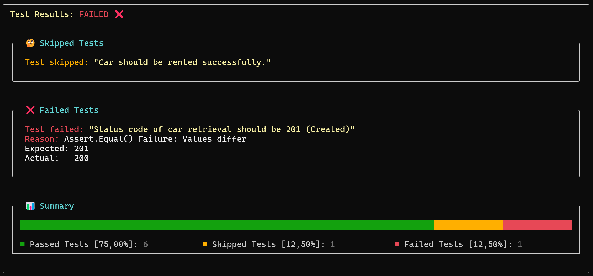

# Reporting

## Console report

At the end of a collection testing run, a summary report of test results is **automatically displayed to console** using `Spectre.Console` components. Here is an example:



## Reporting to File

TeaPie includes a built-in **`JUnit XML` file reporter**, which can be enabled by adding the `-r|--report-file` **option** with a valid path to an `.xml` file where the report will be generated.

This **widely accepted format** is supported natively by **GitHub Actions** and **Microsoft Azure DevOps**. However, it is not fully standardized, and different CI tools may use modified versions of this format. For more details, refer to this [post](https://github.com/testmoapp/junitxml).

Since `JUnit XML` uses **different terminology** than `TeaPie`, here is the mapping:

- **`testsuites`** → **Collection**
- **`testsuite`** → **Test Case**
- **`testcase`** → **Test**

Time is automatically converted to **seconds** (a common practice) with **three decimal places**, using **dot notation**.

## Custom Reporters

The **default console reporter**, powered by `AnsiConsole` from `Spectre.Console`, provides all essential test results details. However, users can **add custom reporters**, either by defining them **inline**:

```csharp
tp.RegisterReporter((summary) =>
{
    if (summary.AllTestsPassed)
    {
        Console.WriteLine($"Success! All {summary.NumberOfExecutedTests} tests passed.");
    }
    else
    {
        Console.WriteLine($"Failure: {summary.PercentageOfFailedTests}% of tests failed.");
    }
});
```

Or for more advanced and customizable reporting, by implementing a custom reporter class that implements the `IReporter<TestsResultsSummary>` interface:

```csharp
public class MyReporter : IReporter<TestsResultsSummary>
{
    public void Report(TestsResultsSummary summary)
    {
        // Custom reporting logic...
    }
}

tp.RegisterReporter(new MyReporter());
```

> All necessary information about results of tests can be found within [TestResultSummary](xref:TeaPie.Testing.TestCaseTestResultsSummary) object. The summary contains properties with access to commonly evaluated statistics as `AllTestsPassed`, `NumberOfFailedTests`, `PercentageOfSkippedTests`, `FailedTests`, ...
